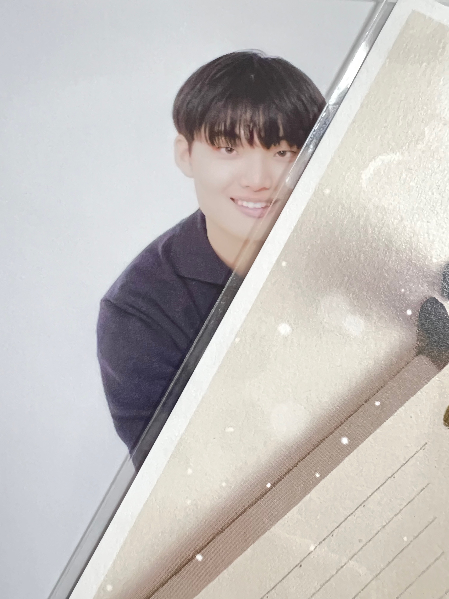

###  About me
<table>
  <tr>
    <td>
      <h2> 손현빈 (Son HyunBin) </h2>
      
 Software Developer
 
      
 Kyunghee Univ. Applied Mathematics & Computer Science Engineering (2022.03 ~ ing)

    </td>
  </tr>
</table>

  

### Experiences
- UMC 7기 F.E Swift 수료 ( 2024.09 ~ 2025.02 ) https://github.com/UMC-Archive
- 구름톤 유니브 4기 수료 B.E Spring ( 2025.03 ~ 2025.11 )
- ACC(AWS Cloud Club) 3기 수료 ( 2025.03 ~ 2025.11 )
- 웹/파이썬 프로그래밍 실습 조교( 2025.03 ~ 2025.06 )
- 구름톤 유니브 4기 - 교내 운영진
### Awards 
- UMC 7기 데모데이 우수상 https://github.com/UMC-Archive
  
### Contact Me
- instagram : harii_lemon
- tech blog : https://blog.naver.com/harryhyunbin
---

### 📊 GitHub Stats  

  
  

